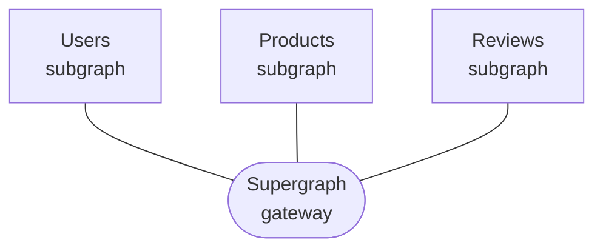

[](https://github.com/apollographql/federation-jvm/actions?query=workflow%3A%22Continuous+Integration%22)
[](LICENSE)
[](https://maven-badges.herokuapp.com/maven-central/com.apollographql.federation/federation-graphql-java-support)
[](https://community.apollographql.com)

# Apollo Federation on the JVM

[**Apollo Federation**](https://www.apollographql.com/docs/federation/) is a powerful, open architecture that helps you create a **unified supergraph** that combines multiple GraphQL APIs.
`federation-graphql-java-support` provides Apollo Federation support for building subgraphs in the `graphql-java` ecosystem. Individual subgraphs can be run independently of each other but can also specify
relationships to the other subgraphs by using Federated directives. See [Apollo Federation documentation](https://www.apollographql.com/docs/federation/) for details.



## Modules

### Federation JVM Support

`federation-graphql-java-support` is built on top of `graphql-java` and provides transformation logic to make your GraphQL schemas Federation compatible. `SchemaTransformer` adds common Federation
type definitions (e.g. `_Any` scalar, `_Entity` union, Federation directives, etc) and allows you to easily specify your Federated entity resolvers.

This project also provides a set of Federation aware instrumentations:

* `CacheControlInstrumentation` - instrumentation that computes a max age for an operation based on `@cacheControl` directives
* `FederatedTracingInstrumentation` - instrumentation that generates trace information for federated operations

See module [README](graphql-java-support/README.md) for details.

### Subscription HTTP Callback Support for Spring GraphQL

GraphQL subscriptions enable clients to receive continual, real-time updates whenever new data becomes available. Unlike
queries and mutations, subscriptions are long-lasting. This means a client can receive multiple updates from a single subscription.

[Spring GraphQL](https://docs.spring.io/spring-graphql/reference/) provides out of box support for GraphQL subscriptions
over WebSockets using [graphql-transport-ws](https://github.com/enisdenjo/graphql-ws) protocol. This library adds support
for subscriptions using [Apollo HTTP callback protocol](https://www.apollographql.com/docs/router/executing-operations/subscription-callback-protocol).

See [Apollo Router](https://www.apollographql.com/docs/router/executing-operations/subscription-support) for additional
details about Federation and Subscription support. See module [README](spring-subscription-callback/README.md) for library
details.

## Contact

If you have a specific question about the library or code, please start a discussion in the [Apollo community forums](https://community.apollographql.com/).

## Contributing

To get started, please fork the repo and checkout a new branch. You can then build the library locally with Gradle

```shell
./gradlew clean build
```

See more info in [CONTRIBUTING.md](CONTRIBUTING.md).

After you have your local branch set up, take a look at our open issues to see where you can contribute.

## Security

For more info on how to contact the team for security issues, see our [Security Policy](https://github.com/apollographql/federation-jvm/security/policy).

## License

This library is licensed under [The MIT License (MIT)](LICENSE).
