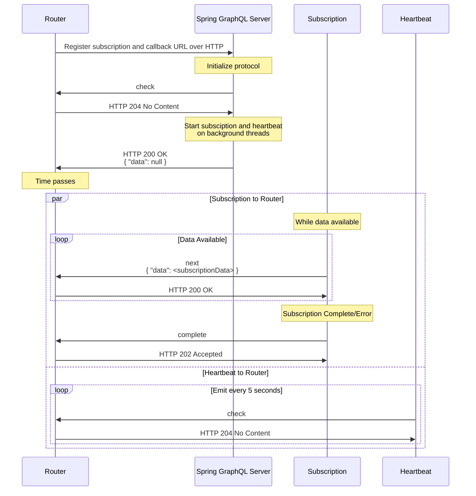

# Subscription HTTP Callback Support for Spring GraphQL

GraphQL subscriptions enable clients to receive continual, real-time updates whenever new data becomes available. Unlike
queries and mutations, subscriptions are long-lasting. This means a client can receive multiple updates from a single subscription.

[Spring GraphQL](https://docs.spring.io/spring-graphql/reference/) provides out of box support for GraphQL subscriptions
over WebSockets using [graphql-transport-ws](https://github.com/enisdenjo/graphql-ws) protocol. This library adds support
for subscriptions using [Apollo HTTP callback protocol](https://www.apollographql.com/docs/router/executing-operations/subscription-callback-protocol).

See [Apollo Router](https://www.apollographql.com/docs/router/executing-operations/subscription-support) for additional
details about Federation and Subscription support.



## Installation

Federation JVM libraries are published to [Maven Central](https://central.sonatype.com/artifact/com.apollographql.federation/federation-spring-subscription-callback).
Using a JVM dependency manager, link `federation-spring-subscription-callback` to your project.

With Maven:

```xml
<dependency>
  <groupId>com.apollographql.federation</groupId>
  <artifactId>federation-spring-subscription-callback</artifactId>
  <version>${latestVersion}</version>
</dependency>
```

With Gradle (Kotlin):

```groovy
implementation("com.apollographql.federation:federation-spring-subscription-callback:$latestVersion")
```

## Usage

In order to enable HTTP subscription callback protocol support you need to configure `SubscriptionCallbackHandler` and
`CallbackWebGraphQLInterceptor` beans in your application context.

`CallbackWebGraphQLInterceptor` works with both WebMVC and WebFlux applications.

Given a subscription

```java
@Controller
public class MySubscriptionController {

    @SubscriptionMapping
    public Flux<Integer> counter() {
        return Flux.just(1, 2, 3, 4, 5, 6)
                .delayElements(Duration.ofMillis(200));
    }
}
```

We can enable subscription HTTP callback support using following configuration

```java
@Configuration
public class GraphQLConfiguration {

    @Bean
    public SubscriptionCallbackHandler callbackHandler(ExecutionGraphQlService graphQlService) {
        return new SubscriptionCallbackHandler(graphQlService);
    }

    // This interceptor defaults to Ordered#LOWEST_PRECEDENCE order as it should run last in chain
    // to allow users to still apply other interceptors that handle common stuff (e.g. extracting
    // auth headers, etc).
    // You can override this behavior by specifying custom order.
    // You can also provide a set of HTTP headers that should be propagated to the callback responses.
    @Bean
    public CallbackWebGraphQLInterceptor callbackGraphQlInterceptor(
            SubscriptionCallbackHandler callbackHandler) {
        return new CallbackWebGraphQLInterceptor(callbackHandler);
    }

    // regular federation transforms
    // see https://docs.spring.io/spring-graphql/reference/federation.html
    @Bean
    public GraphQlSourceBuilderCustomizer customizer(FederationSchemaFactory factory) {
        return builder -> builder.schemaFactory(factory::createGraphQLSchema);
    }

    @Bean
    FederationSchemaFactory federationSchemaFactory() {
        return new FederationSchemaFactory();
    }
}
```

By default, subscription and heartbeat stream will be executed in non-blocking way on [bounded elastic](https://projectreactor.io/docs/core/release/api/reactor/core/scheduler/Schedulers.html#boundedElastic--)
scheduler. If you need more granular control over the underlying scheduler, you can configure callback handler to run on
your provided scheduler.

```java
@Bean
public SubscriptionCallbackHandler callbackHandler(ExecutionGraphQlService graphQlService) {
    Scheduler customScheduler = <provide your custom scheduler>;
    return new SubscriptionCallbackHandler(graphQlService, customScheduler);
}
```
